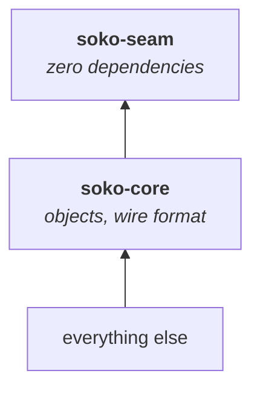

# Architecture

> **Pre-alpha.** The workspace lists only crates that exist. Planned crates are a comment in
> `Cargo.toml` with the TRACT section each answers — an empty crate per section would claim
> coverage that is not there.

## Language and why

Rust, because the substrate's reference implementation is Rust (`dmtap-core`, `dmtap-sync`) and
Soko must be byte-interoperable with it rather than a second implementation of the same objects
that drifts.

## Dependency direction, fixed from the first commit

`soko-seam` depends on nothing and must stay that way — `cargo tree -p soko-seam` is one line. A
dependency added there is inherited by every implementor of the seam, which is exactly what a seam
exists to prevent.

## Crates

| Crate | TRACT § | Covers |
|---|---|---|
| `soko-seam` | §9, §12 | settlement / escrow / storefront traits that name no provider — **zero dependencies, enforced in CI** |
| `soko-core` | §16 | content addresses, money, places, time, and the `public` / `sealed` split |
| `soko-offer` | §3–§5 | the four axes; `place_of_supply_kind` derives the tax anchor from fulfilment |
| `soko-catalog` | §2 | product records, groups, identity ladder, `canonicalise` |
| `soko-order` | §6–§7 | cart, per-seller split, `BoundedCounter` inventory, sealed orders |
| `soko-delivery` | §8 | rate cards, volumetric weight, legs, consignments, distributors, route comparison |
| `soko-settle` | §9 | payment attestations, rail classes, `EscrowScope::check` |
| `soko-trust` | §10 | reviews, purchase attestation, per-index `Weighting`, `local_score` |
| `soko-jurisdiction` | §11 | four anchors, `place_of_supply`, `ResponsibleParties::may_offer_into` |
| `soko-gateway` | §12 | store bindings and `origin_isolated_from` |
| `soko-node` | — | the node binary |

The gateway is a crate but **not a role of the node binary**: it terminates untrusted connections
and renders untrusted merchant bundles, so it runs as a separate process with no access to identity
keys or the object store (§12.4).

## What the tests actually pin

104 tests, concentrated on the places where being wrong is silent rather than loud:

- **volumetric weight** — a large light parcel priced on actual weight under-quotes, and the buyer
  finds out at the counter;
- **currency mismatch** — a route total that silently converts is a wrong total that looks right,
  and it gets carried into a signed order;
- **escrow scope** — an operator licensed for one region must be refused for another, including
  when only the *place of supply* is out of region;
- **place of supply** — an event held abroad is taxed at the venue; a mode that needs a venue and
  has none refuses to guess rather than falling back to a party's country;
- **oversell** — two replicas selling concurrently with no coordination cannot exceed total stock,
  and a replica can be exhausted while stock remains elsewhere;
- **reputation** — unattested reviews do not move a conservative score, and two indexes with
  different weightings legitimately disagree.

Eleven of them exist because an adversarial review found the opposite of what this page claimed. The
project's pitch is that invariants are structural rather than remembered, and on six counts they
were remembered:

| Was | Now |
|---|---|
| `BoundedCounter`'s fields were `pub`, so `counter.quota = u32::MAX` conjured stock with no method call at all | fields private, `new()` is the only way rights enter the system, `rights()` exposes the conserved quantity |
| `place_of_supply` took the venue as a parameter alongside the fulfilment, so a caller could pass a country that disagreed and get a confident wrong answer | the venue is read out of the `Fulfilment` itself; no argument can contradict it |
| `origin_isolated_from` compared raw strings, reporting `alice.example` and `Alice.example` as isolated when a browser treats them as one origin | hosts are lowercased and root-dot-stripped before comparison |
| `RouteOption::total` used `+=` on `i64` — release builds have overflow checks off, so it wrapped to a large negative total | `checked_add`, returning `Error::Overflow` |
| `billable_grams` cast `u64` to `u32`, reporting a 1700mm cube at an eighth of its real weight | saturates instead of wrapping, and `RateCard::is_usable` rejects implausible divisors |
| `Publishable`/`Sealed` were described as type-level separation but appear only as empty `impl`s | documented as what they are — a review aid; the real defence is the grammar (TRACT §16.4) |

That last row is the honest one: a marker trait with no bound proves nothing about a type's
contents, and two `Publishable` types still carry free text a user could type an address into.

Two further tests are integration tests in `soko-node/tests/end_to_end.rs`, which walk one complete
trade through every crate. That is a different kind of check: the unit tests prove each type behaves, and
this proves they compose — which is where a design that reads fine section by section usually comes
apart. `cargo run -p soko-node -- demo` prints the same trade in readable form.

## The public/sealed split is structural

`soko-core` separates `public` and `sealed` into distinct modules rather than one flat namespace,
because the rule they encode is easy to violate by accident:

- **public** — signed, content-addressed, globally deduplicated, **irrevocable**. Products, offers,
  rate cards, reviews. A type here must be structurally incapable of carrying a name or an address.
- **sealed** — encrypted to the counterparties, never published, deletable at the edges. Orders,
  addresses, contact details, payment references.

A right to erasure cannot be satisfied against an irrevocable content-addressed object. Keeping the
two in separate modules is cheaper than remembering the rule at every call site.

## What Soko does not implement

Identity, signing, content addressing, feeds, blobs, sync and reachability are the **DMTAP
substrate's** job. Soko adopts them. A hash construction or signature framing invented inside
`soko-core` is a bug, not a feature.

Settlement rails are **patala's** job, or any other implementation of the seam. Soko wires the
seam; it does not ship a rail.

## Gateway process isolation

The gateway terminates untrusted connections and renders untrusted merchant bundles. It runs as a
separate process with no access to identity keys or the object store, and serves every store from
its own origin. "One binary, several roles" never means one address space.

