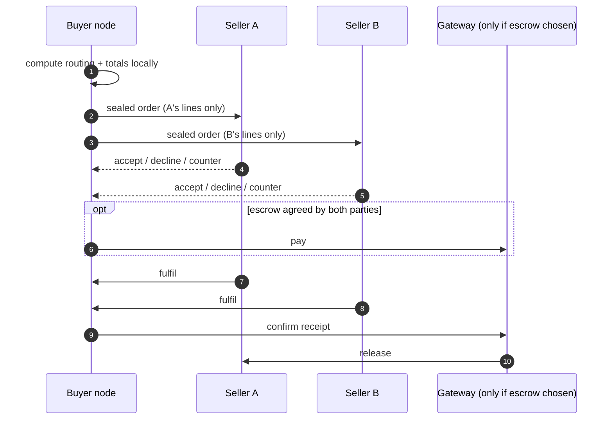

# Cart & checkout

## The cart is the buyer's

A cart is **CRDT state on the buyer's own devices**, synced between them by the substrate's Sync
capability. It is not a session on anyone's server.

Consequences, all of which fall out of that one decision:

- A cart survives any store closing, any gateway changing, any index disappearing.
- It spans sellers who have never heard of each other, because nothing needs to coordinate them.
- **No party sees the whole cart.** Each seller learns only its own lines, at order time. There is
  no shared session record to breach, subpoena, or sell.
- Wishlist and purchase history work the same way and are equally portable.

"Live" cart behaviour — prices and stock updating while you shop — is the buyer's node subscribing
to the availability feeds of items already in the cart and re-evaluating locally. The seller is not
told you are looking.

## Checkout across independent sellers

The buyer's node is the orchestrator. There is no central checkout service.

An order is a **sealed message**, one per seller, containing only that seller's lines plus what is
needed to fulfil them. Cross-seller totals exist only on the buyer's device.

## Reservations and oversell

This is the genuinely hard part, and the place where a mesh has to work for something a central
database gives away free with a row lock.

A seller running one node has no problem. A seller running **several replicas** — a shop counter, a
warehouse, a cloud node — needs stock decrements to converge without overselling. A naive
last-write-wins counter oversells; a strongly-consistent counter needs a coordinator, which is the
thing being removed.

The approach TRACT specifies is an **escrow-style bounded counter**: total stock is partitioned
into per-replica quotas, each replica may sell freely within its own quota without coordinating,
and replicas transfer quota between themselves when one runs low. The invariant "sum of all sales ≤
total stock" holds without a lock, at the cost of a replica sometimes reporting out-of-stock while
another still holds quota.

**Honest limits:**

- A replica that is partitioned and holds unused quota strands that stock until it rejoins.
- Cross-*seller* atomicity does not exist. A multi-seller cart is a set of independent orders, so
  one seller declining does not roll back another's acceptance. Checkout is modelled as
  compensating actions (cancel, refund), never as a distributed transaction — because a
  distributed transaction across sovereign parties would need a coordinator with authority over
  all of them.
- The buyer sees this honestly: a multi-seller cart shows per-seller status, never a single
  all-or-nothing "order placed" that is not true.
