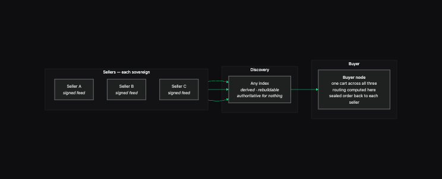
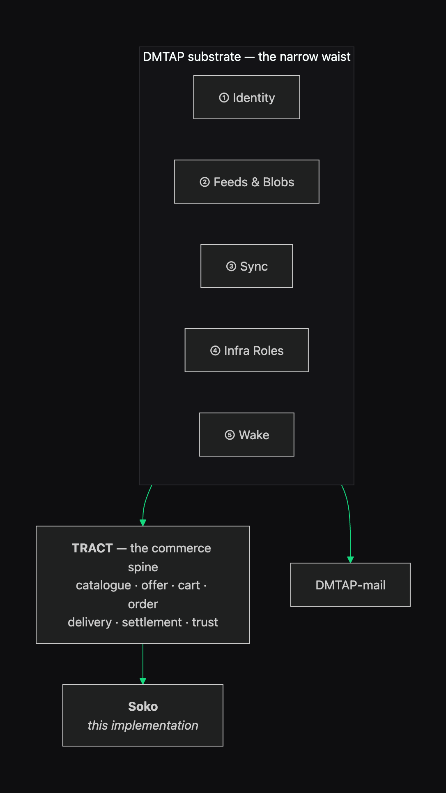
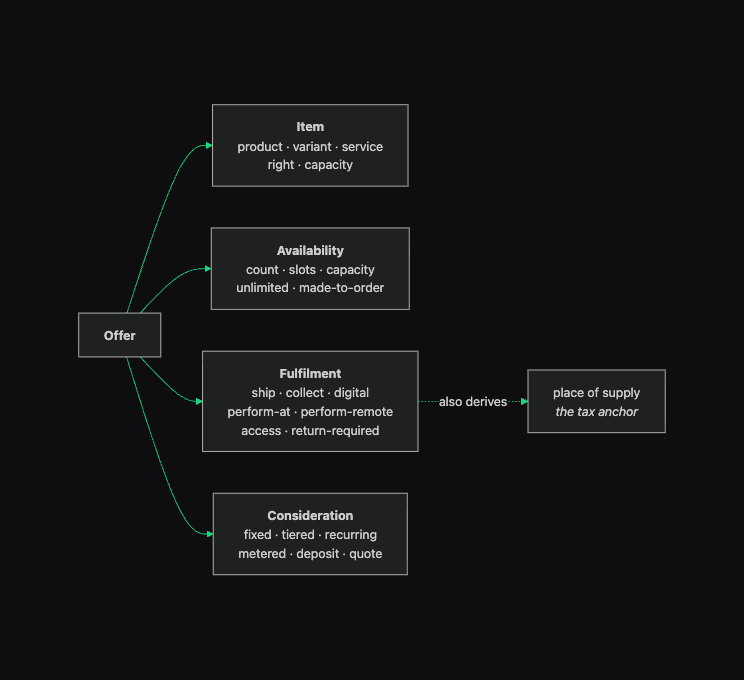
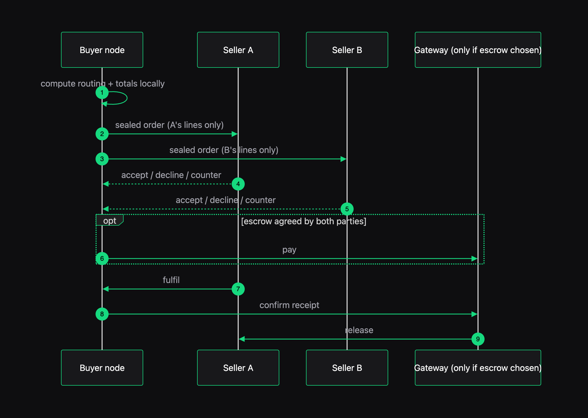
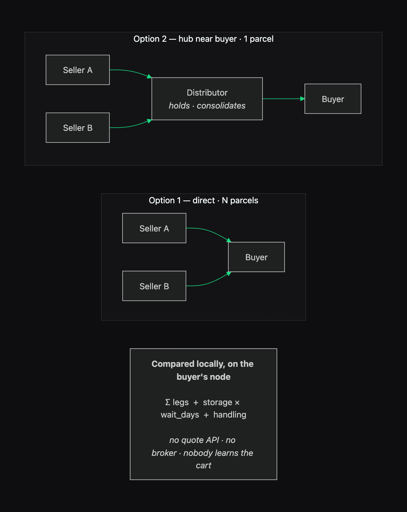
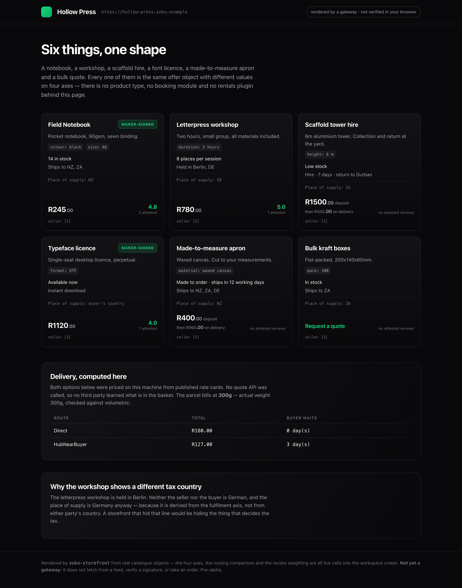

# Diagrams

> **These are architecture diagrams, not product screenshots.** There is now one real rendered
> surface — see [the storefront](#the-storefront) below and `docs/screenshots/` — but the diagrams
> here describe structure that has no picture. Both are regenerated from source rather than
> hand-maintained: [`tools/diagrams.mjs`](https://github.com/vul-os/soko/blob/main/tools/diagrams.mjs)
> for these, [`tools/screenshots.mjs`](https://github.com/vul-os/soko/blob/main/tools/screenshots.mjs)
> for the storefront, which builds the binary and photographs what it actually prints.

## One cart across sovereign sellers



Each seller publishes a signed feed. Any node may build an index over those feeds; none is
authoritative, and a disagreement between an index and a feed resolves in favour of the feed. The
buyer's node assembles one cart across all of them and sends a **separate sealed order to each
seller**, containing only that seller's lines — so the cross-seller view exists nowhere but on the
buyer's own device.

## Where Soko sits



Soko does not invent its own cryptographic conventions. `soko-feed` restates the DMTAP substrate's
identity, signing and content-addressing conventions in its own code, proved byte-identical to
`kotva-core`'s own implementation by dev-dependency cross-check tests — `kotva-core` is never called
at runtime. Blobs, sync and reachability come from the substrate; TRACT adds only the commerce
spine; Soko is one implementation of TRACT. A different hash or signing construction would be a bug,
not a feature.

## The four axes



Goods, services, rentals, bookings and subscriptions are the same object with different axis
values. Note the dotted edge: **fulfilment also derives place of supply**, which is the tax anchor.
That is why an event held abroad is taxed at the venue regardless of where either party lives, and
why a two-anchor model cannot express it. See [Jurisdiction](./jurisdiction.md).

## Checkout across independent sellers



The buyer's node is the orchestrator; there is no central checkout service. Note what is
conditional: the gateway appears **only** if both parties chose escrow. Two TRACT-native parties
never need one.

Note also what is absent: any step that makes the multi-seller order atomic. One seller declining
does not roll back another's acceptance — that would need a coordinator with authority over
sovereign parties. Checkout is compensating actions, and an interface must show per-seller status
rather than a single "order placed". See [Cart & checkout](./cart.md).

## Delivery routing



Rate cards are published as signed public objects, so the comparison runs **on the buyer's node**
over locally cached data. No quote API, no rate limit, and no third party learns what is being
bought or from whom.

The candidate set is deliberately small — a handful of hubs, not a fleet-wide optimisation — so it
can be evaluated exhaustively without an optimiser or a service. The unreliable input is
`wait_days`: when the slowest seller's parcel actually arrives. It is an estimate and must be shown
as one. See [Delivery & routing](./delivery.md).

## The storefront



The one surface a shopper sees. Six listings — a notebook, a workshop, a scaffold hire, a font
licence, a made-to-measure apron and a bulk quote — are the **same offer object** with different
values on four axes. There is no product type, no booking module and no rentals plugin behind that
page; `availability_line`, `fulfilment_line` and `price_line` each match on their own axis, so a
haircut and a tin of beans take the same code path.

Two details worth looking for. The workshop's place of supply reads **DE** while neither the seller
nor the buyer is German — it is derived from the fulfilment axis, and a storefront that hid that
line would be hiding the thing that decides the tax. And the notebook scores 4.8 from "2 attested"
rather than 3 reviews, because the unattested one-star carries no weight under a conservative
index (§10) — a different index may weight it differently, and that divergence is the design.

The header says *rendered by a gateway · not verified in your browser*, which is the honest
statement of §12's trust downgrade: a shopper without a keypair cannot check the signature and is
trusting the renderer.

**What it is not:** it does not fetch from a feed, verify a signature, or take an order. Those are
the parts that would make it a gateway rather than a renderer, and they are not built.

## Regenerating

```sh
node tools/diagrams.mjs        # architecture diagrams; needs Chrome, CHROME_PATH overrides
node tools/screenshots.mjs     # builds soko-storefront and photographs its output
```

Every diagram source lives in that one file, so a diagram cannot drift from a hand-edited copy of
itself.
