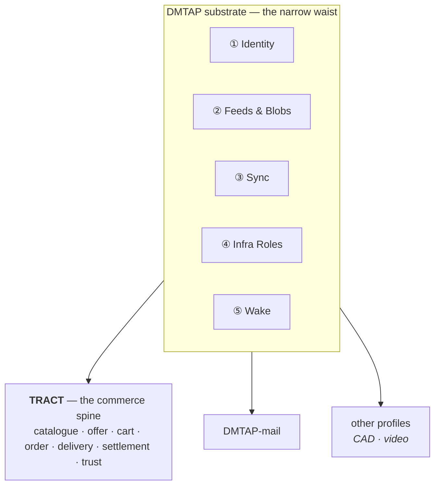

# The TRACT protocol

Soko implements TRACT. **TRACT is the standard; Soko is one implementation of it.** Independent
implementations must be buildable from the specification alone, without reading this code. Where
Soko and the spec disagree, the spec wins.

- Specification: <https://github.com/vul-os/kotva/tree/main/profiles/tract>
- This implementation: <https://github.com/vul-os/soko>

## TRACT stands on the DMTAP substrate

TRACT is not a new stack. It adopts the five substrate capabilities defined by
[DMTAP](https://github.com/vul-os/kotva), under that directory's à-la-carte adoption rule — *if a
product implements a capability's function, it MUST speak that capability's spec* — and adds only
the commerce spine.

| Capability | What TRACT uses it for |
|---|---|
| **Identity** — keypair, device certificates, `name→key`, key transparency | seller, buyer, courier, distributor, gateway identity |
| **Feeds & Blobs** — signed append-only feeds, content-addressed blobs | catalogues, offers, rate cards, capacity, reviews |
| **Sync** — signed CRDT operations, range-Merkle reconciliation | carts across devices; inventory across replicas |
| **Infrastructure Roles** — announce/resolve, relay, mailbox, cache | reachability for stores and buyers behind NAT |
| **Wake** — content-free push | waking a sleeping seller node when an order arrives |

**TRACT allocates no new cryptography.** No new hash construction, no new signature framing, no
new content-address scheme. If you find one being invented in `soko-core`, that is a bug.

## Why the identity reuse matters

A seller's identity, a buyer's identity, and a mail identity are the *same key*. A shopper does not
create an account to buy — they already have one, and it is theirs. This is also why there is no
"sign up" step in any Soko flow: there is nothing to sign up to.

## The two quadrants

DMTAP's feeds give authenticity **without** confidentiality; its sealed message object gives
confidentiality **and** authenticity. TRACT splits commerce along exactly that line, and it is a
hard rule:

| Public — signed, content-addressed, **irrevocable** | Sealed — encrypted, per-party, **deletable** |
|---|---|
| product records, offers, prices | orders and order lines |
| availability signals | buyer name, address, contact |
| carrier and distributor rate cards | payment references |
| storefront render bundles | consignment routing detail |
| reviews (pseudonymous) | dispute correspondence |

> **No personal data may enter the public quadrant.** Published objects are content-addressed and
> irrevocable, so a right to erasure cannot be satisfied against them. This is why `soko-core`
> splits `public` and `sealed` into separate modules rather than one namespace — the rule is
> cheaper to enforce structurally than to remember.

## Reachability, and why there is no webhook tunnel

A common question: how does a seller's machine behind CGNAT receive an order? Not with ngrok.

The substrate's reachability ladder handles it — direct, then hole-punching, then a **content-blind
circuit relay**, with a short-TTL content-blind mailbox for offline holding and content-free push
to wake a sleeping device. The sender's node holds the retry queue, so durability lives at an edge
rather than in the middle.

Compare a tunnel service: it terminates TLS, so it can read every order that passes through, and it
is a company that can revoke you. The relay role is the same shape with the trust removed.
